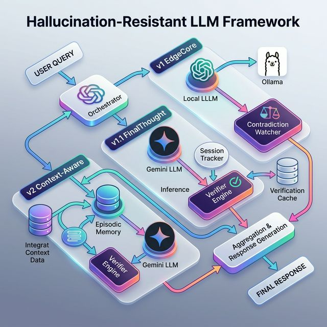

# 🔬 TruthGuard AI: Hallucination-Resistant LLM Framework

**TruthGuard AI** is a research framework that proves small, local LLMs can achieve **100% factual faithfulness** in long-form conversations through a structured **Memory Vault** architecture — no fine-tuning, no external API required.

> **Result**: `qwen2.5:1.5b` (1.5B Params, local) scored **100% Retrieval Faithfulness** and **100% Contradiction Catching** across 10, 30, and 50-turn sessions — outperforming both `Llama 3.2` and `Gemini Flash` under identical constraints.

---

## 🏆 Key Result

| Model | Architecture | Context Limit | Faithfulness | Contradiction Catch |
| :--- | :--- | :--- | :--- | :--- |
| **Qwen 2.5 1.5B** | **v2 Context-Aware** | **2,048 tokens** | **100.0%** | **100.0%** |
| Qwen 2.5 1.5B | v1 EdgeCore (Gated) | 2,048 tokens | 14.3% | N/A |
| Qwen 2.5 1.5B | Baseline (No assist) | 2,048 tokens | 1.0% | 0.0% |

---

## 🏗️ System Architecture



The framework employs a multi-tiered approach to ensure factual integrity:
- **Orchestrator**: Manages the flow between different model pipelines.
- **v1 EdgeCore**: Baseline gated evidence retrieval.
- **v1.1 FinalThought**: Interceptor pipeline with draft generation, claim extraction, and parallel verification mesh.
- **v2 Context-Aware (ULTIMA-X)**: Advanced memory-vault system featuring Episodic Memory, Session Tracking, and a post-generation Contradiction Watcher.
- **Verification Layer**: TTL-based caching and concurrent NLI verification against multiple evidence sources.

---

## 🧠 Why This Works

The **low-context window** (2,048 tokens) is the key constraint. Without it, models can simply retain everything in their native context and appear "faithful". By forcing a strict token limit:

1. **Baseline models fail** — they literally cannot "remember" facts stated earlier in the session.
2. **The v2 Memory Vault wins** — it retrieves facts from its `EpisodicMemory` store, bypassing the context limit entirely.

This validates the core hypothesis: **a well-designed retrieval system is more reliable than a large context window**.

---

## 📂 Architecture

```text
hallucination-resistant-llm-framework/
├── core/
│   ├── ollama_llm.py        # Local LLM interface (num_ctx=2048 enforced)
│   ├── gemini_llm.py        # Cloud LLM interface (8192 char truncation)
│   └── llm_interface.py     # Abstract LLM base class
├── models/
│   ├── v1_edgecore/         # Gated evidence retrieval (Baseline comparator)
│   └── v2_context_aware/    # Memory Vault: SessionTracker + EpisodicMemory ✅
├── experiments/
│   ├── run_all.sh           # Main sweep script (Qwen-focused)
│   ├── run_edgecore_eval.py # Baseline ablation script
│   ├── run_memory_eval.py   # v2 Memory Vault eval script ✅
│   ├── summarize_results.py # Cross-model leaderboard generator
│   ├── final_analysis.md    # Full scientific breakdown
│   └── results/             # Raw CSVs and logs (tracked via Git LFS)
├── evidence_data/           # Local knowledge base (simulated RAG store)
├── config.py                # Auto-loads GEMINI_API_KEY from .env
├── LEADERBOARD.md           # 4-architecture comparison summary
└── SCIENTIFIC_ANALYSIS.md  # Full research findings
```

---

## 🛠️ Setup

```bash
# 1. Clone
git clone https://github.com/anurag-basistha/hallucination-resistant-llm-framework.git
cd hallucination-resistant-llm-framework

# 2. Create and activate virtual environment
python3 -m venv venv && source venv/bin/activate

# 3. Install dependencies
pip install -r requirements.txt

# 4. Create your .env file for the Gemini API key (optional)
echo "GEMINI_API_KEY=your_key_here" > .env

# 5. Ensure Ollama is running with Qwen 2.5 1.5B
ollama pull qwen2.5:1.5b
```

---

## 🚀 Run the Experiment

```bash
# Run the full sweep (Qwen-focused, low-context mode)
./experiments/run_all.sh

# Generate the leaderboard from existing results
python3 experiments/summarize_results.py experiments/results/<run_dir>
```

---

## ⚙️ Configuration

| Parameter | Location | Default | Purpose |
| :--- | :--- | :--- | :--- |
| `num_ctx` | `core/ollama_llm.py` | `2048` | Forces local LLM context limit |
| `max_context_chars` | `core/gemini_llm.py` | `8192` | Simulates context limit for cloud |
| `GEMINI_API_KEY` | `.env` | — | Auto-loaded for cloud comparison |
| `NUM_SAMPLES` | `run_all.sh` | `2` | Samples per eval (increase for full sweep) |

---

## 📄 License

MIT License. Free to use for research and commercial applications.
